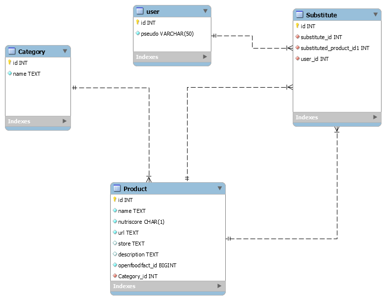

# The five Project : Openfoodfacts data

# Description:
* Retrieving data from the open food facts API in mysql database.
The user chooses a product and the program offers a substitute product with a better nutriscore.

# Technical tools:
* Backend: Python 3.7
* DB Mysql

# Local installation:
* Install libraries cmd: "pip install riquirements.txt"
* Install Interpreter cmd: "P5_opff\Scripts\activate.bat activate"
